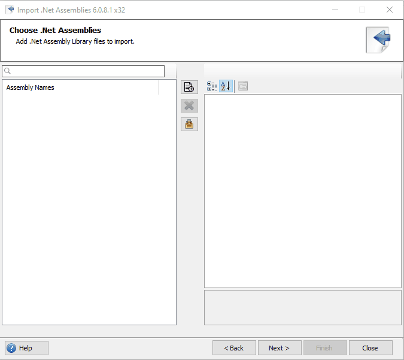

# Import .Net DLL and access members of .Net types from Delphi

This sample demonstrates how to load an external dll (_Mathematics.dll_) using the [.Net DLL Importer for Delphi](https://crystalnet-tech.com/RuntimeLibrary/RuntimeLibUtilities) and access the methods generated by the tool.

<br>
    
### The .Net DLL Importer below demonstrates how to import _Mathematics.dll_ and generate delphi units



<br>

The import utility generates the following units:
* **Mathematics.Consts.pas**: This unit contains the string constant variables of the assembly ID, the assembly load option path and the fullnames of the _Matheatics.dll_ assembly types imported.
* **Mathematics.Intf.pas**: This unit contains the types and members of the types imported from the _Matheatics.dll_ assembly file which is represented as interfaces. These interfaces are inherited by the classes generated and saved in the **Mathematics.pas**.
* **Mathematics.pas**: This unit contains the types and members of the types imported from the _Matheatics.dll_ assembly file which is represented as classes in this unit.

<br>

The _Matheatics.dll_ library C# Source codes:

```
namespace Mathematics
{
    public class Mathematics
    {
        public int Add(int a, int b)
        {
            return a + b;
        }
        .....
    }
}
  ```
<br>

The importer create a corresponding Delphi interface and class type of Mathematics type in the _Mathematics.dll_
```
type
	[TypeMapping(sD_TMathematics, sC_Mat_Mathematics)]
	IMathematics = interface(IClrBase)
	['{A7FEDBBA-A0EB-44F5-9375-EA27C85EAF5C}']
	  { public }
	  function Add(a: Integer; b: Integer): Integer;
    	  ...
  end;
```
<br>

The import utility registers the 3rd party (_Mathematics.dll_) assembly and the assembly is loaded automatically at runtime.
```
initialization
  TClrAssembly.RegisterDLLAssembly(sC_Mathematics_Asm_ID, sC_Mathematics_sC_AssemblyPath, ltfileLocation, False);
```
<br>

To create an instance of the Mathematic Type, call the CreateInstance method on the TClrDispatchActivator class
```
var
  Mathematics : IMathematics;
...

Mathematics := TMathematics.Create;
```
<br>

Once the Mathematics object has been ceated, you can now call the methods on the object.
```
Mathematics.Add(30, 50);
```

<br>
<br>
<br>


